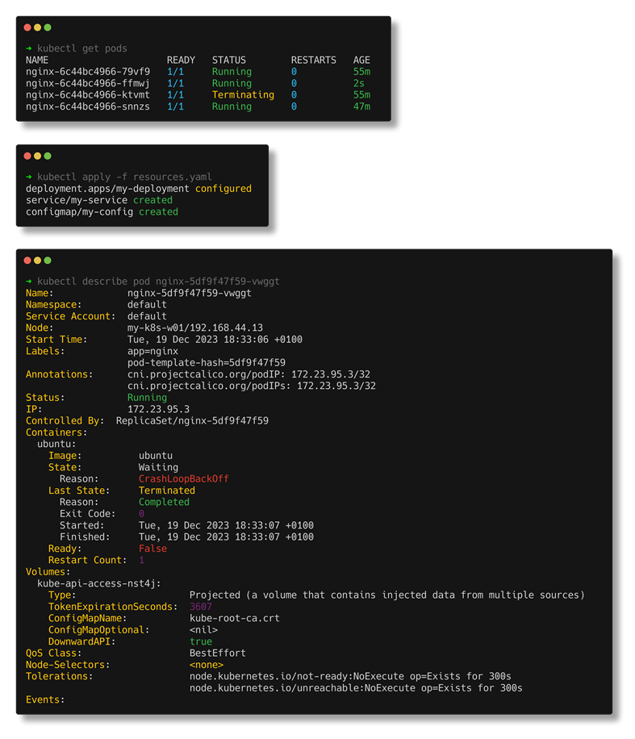

# kubecolor

KubeColor is a `kubectl` replacement used to add colors to your kubectl output.

[](https://github.com/kubecolor/kubecolor/actions/workflows/test.yml)
[](https://goreportcard.com/report/github.com/kubecolor/kubecolor)
[](https://codecov.io/gh/kubecolor/kubecolor)

<picture>
  <source srcset="./docs/kubectl-combined.png" media="(min-width: 1600px)" />
  <source srcset="./docs/kubectl-combined-medium.png" media="(min-width: 800px)" />
  
</picture>

* You can also change color theme for light-backgrounded environment

  

## What's this?

kubecolor colorizes your `kubectl` command output and does nothing else.
kubecolor internally calls `kubectl` command and try to colorizes the output so
you can use kubecolor as a complete alternative of kubectl. It means you can write this in your .bash_profile:

```sh
alias kubectl="kubecolor"
```
If you use your .bash_profile on more than one computer (e.g. synced via git) that might not all have `kubecolor`
installed, you can avoid breaking `kubectl` like so:

```sh
command -v kubecolor >/dev/null 2>&1 && alias kubectl="kubecolor"
```

For now, not all subcommands are supported and some of them might be in the future. If you want something to be supported by kubecolor, you can open an issue in this GitHub repo.
Even if what you want to do is not supported by kubecolor right now, kubecolor still can just show `kubectl` output without any decorations,
so you don't need to switch kubecolor and kubectl but you always can use kubecolor.

Additionally, if `kubectl` resulted an error, kubecolor just shows the error message in red or yellow.

**Please keep in mind that kubecolor has runtime overhead compared to kubectl because it runs kubectl internally and parses the output, then colorizes it.**

## Installation

### Homebrew


```sh
brew install kubecolor/tap/kubecolor
```

### Scoop


```sh
scoop install kubecolor
```

### Nix

[](https://repology.org/project/kubecolor/versions)

```sh
nix-shell -p kubecolor
```

### AUR (Arch User Repositories)

[](https://repology.org/project/kubecolor/versions)

```sh
yay -Syu kubecolor
```

### Download binary via GitHub release

Go to [Release page](https://github.com/kubecolor/kubecolor/releases) then download the binary which fits your environment.

### Compile from source

Requires Go 1.21 (or later)

```sh
go install github.com/kubecolor/kubecolor@latest
```

## Usage

kubecolor understands every subcommands and options which are available for `kubectl`. What you have to do is just using `kubecolor`
instead of `kubectl` like:

```sh
kubecolor --context=your_context get pods -o json
```

If you want to make the colorized kubectl default on your shell, just add this line into your shell configuration file:

```sh
alias kubectl="kubecolor"
```

### Dynamic tty support

When the kubecolor output tty is not standard output, it automatically disables the colorization.
For example, if you are running `kubecolor get pods > result.txt` or `kubecolor get pods | grep xxx`, the output will be passed through to file or another command, so colorization is not applied.
You can force kubecolor do colorization at such cases by passing `--force-colors` flag. See the upcoming section for more details.

### Flags

Available flags for kubecolor. When you pass them, kubecolor will understand them but these flags won't be passed to kubectl.

* `--kubecolor-version`

Prints the version of kubecolor (not kubectl one).

* `--light-background`

When your terminal's background color is something light (e.g white), default color preset might look too bright and not readable.
If so, specify `--light-background` as a command line argument. kubecolor will use a color preset for light-backgrounded environment.

* `--force-colors`

By default, kubecolor never output the result in colors when the tty is not a terminal standard output.
If you want to force kubecolor to show the result in colors for non-terminal tty, you can specify this flag.
For example, when you want to pass kubecolor result to grep (`kubecolor get pods | grep pod_name`), this option is useful.

* `--plain`

When you don't want to colorize output, you can specify `--plain`. Kubecolor understands this option and outputs the result without colorizing.

### ENV Variables

* `KUBECOLOR_OBJ_FRESH`

When setting the variable `KUBECOLOR_OBJ_FRESH` to a duration, you can change the color of the object depending on its creation time.

Please see [Specify object fresh age threshold](#specify-object-fresh-age-threshold)

* `KUBECOLOR_FORCE_COLORS`

In addition to forcing colors with `--force-colors`, you can also do so by setting the environment variable `KUBECOLOR_FORCE_COLORS=true`.
You can use this environment variable to colorize output when you invoke kubecolor in the `watch` command (e.g. `watch kubecolor get pods`).
Set the following alias:

```shell
alias watch='KUBECOLOR_FORCE_COLORS=true watch --color '
```

Be sure to include the space at the end to enable alias expansion (without this additional space, the command `watch kgp` would fail, for example).

* `KUBECOLOR_LIGHT_BACKGROUND`

In addition to use the light color preset with `--light-background`, you can also do so by setting the environment variable `KUBECOLOR_LIGHT_BACKGROUND=true`.

### Autocompletion

kubectl provides [autocompletion feature](https://kubernetes.io/docs/tasks/tools/install-kubectl/#enable-kubectl-autocompletion). If you are
already using it, you might have to configure it for kubecolor.
Please also refer to [kubectl official doc for kubectl autocomplete](https://kubernetes.io/docs/reference/kubectl/cheatsheet/#kubectl-autocomplete).

#### Bash

For Bash, configuring autocompletion requires adding following line in your shell config file (e.g `~/.bashrc`).

```shell
# autocomplete for kubecolor
complete -o default -F __start_kubectl kubecolor
```

If you are using an alias like `k="kubecolor"`, then just change above like:

```shell
complete -o default -F __start_kubectl k
```

#### Zsh

For zsh make sure these lines are present in your zsh config file (e.g `~/.zshrc`):

```shell
# get zsh complete kubectl
source <(kubectl completion zsh)
alias kubectl=kubecolor
# make completion work with kubecolor
compdef kubecolor=kubectl
```

#### fish

Fish completion is officially unsupported by `kubectl`, so it is unsupported by `kubecolor` as well.

However, there are 2 ways we can make them work. Please keep in mind these are a kind of "hack" and not officially supported.

1. Use [evanlucas/fish-kubectl-completions](https://github.com/evanlucas/fish-kubectl-completions) with `kubecolor`:

   * Install `kubectl` completions (https://github.com/evanlucas/fish-kubectl-completions):

      ```fish
      fisher install evanlucas/fish-kubectl-completions
      ```

   * Add the following function to your `~/.config/fish/config.fish` file:

      ```fish
      function kubectl
        kubecolor $argv
      end
      ```

2. Use [awinecki/fish-kubecolor-completions](https://github.com/awinecki/fish-kubecolor-completions)

   The first way will override `kubectl` command. If you wish to preserve both `kubectl` and `kubecolor` with completions, you need to copy [evanlucas/fish-kubectl-completions](https://github.com/evanlucas/fish-kubectl-completions) for the `kubecolor` command.

   For this purpose, you can use [awinecki/fish-kubecolor-completions](https://github.com/awinecki/fish-kubecolor-completions).

#### PowerShell

For PowerShell (pwsh) add the following lines to your profile
(`$PROFILE`, e.g `C:\Users\yourusername\Documents\PowerShell\Microsoft.PowerShell_profile.ps1`):

```powershell
# Completion for kubectl
if (Get-Command kubectl -ErrorAction SilentlyContinue) {
  # This also registers the $__kubectlCompleterBlock variable
  kubectl completion powershell | Out-String | Invoke-Expression
}

# Set aliases
Set-Alias -Name k -Value kubectl
Set-Alias -Name kubectl -Value kubecolor

# Reuse the kubectl completion on kubecolor and the aliases
Register-ArgumentCompleter -CommandName 'k','kubectl','kubecolor' -ScriptBlock $__kubectlCompleterBlock
```

### Specify what command to execute as kubectl

Sometimes, you may want to specify which command to use as `kubectl` internally in kubecolor. For example, when you want to use a versioned-kubectl `kubectl.1.19`, you can do that by an environment variable:

```shell
KUBECTL_COMMAND="kubectl.1.19" kubecolor get po
```

When you don't set `KUBECTL_COMMAND`, then `kubectl` is used by default.

### Specify object fresh age threshold

When you want to figure out which object are recently created the fresh ones are colored green. It only works with `get` subcommand.
You can customize threshold level by using environment variable `KUBECOLOR_OBJ_FRESH` with value format [time.Duration](https://golang.org/pkg/time/#ParseDuration).

```shell
KUBECOLOR_OBJ_FRESH="1m" kubecolor get po
```

Default value is `0s`, it means is disabled.

## Color theme

> [!NOTE]
> Feature available since kubecolor v0.3.0

With a lot of config options, kubecolor allows you to precisely tailor the
colors of your output.

<!-- To regenerate the theme part, run `go run ./internal/cmd/configdoc` and copy paste the result -->

| Environment variable                 | Type    | Description                                                                                                                                                                                                                                         | Dark theme
| --------------------                 | ----    | -----------                                                                                                                                                                                                                                         | ----------
| `KUBECOLOR_THEME_BASE_INFO`          | color   | general color for when things are informational                                                                                                                                                                                                     | `white`
| `KUBECOLOR_THEME_BASE_PRIMARY`       | color   | general color for when things are focus                                                                                                                                                                                                             | `magenta`
| `KUBECOLOR_THEME_BASE_SECONDARY`     | color   | general color for when things are secondary focus                                                                                                                                                                                                   | `cyan`
| `KUBECOLOR_THEME_BASE_SUCCESS`       | color   | general color for when things are good                                                                                                                                                                                                              | `green`
| `KUBECOLOR_THEME_BASE_WARNING`       | color   | general color for when things are wrong                                                                                                                                                                                                             | `yellow`
| `KUBECOLOR_THEME_BASE_DANGER`        | color   | general color for when things are bad                                                                                                                                                                                                               | `red`
| `KUBECOLOR_THEME_BASE_MUTED`         | color   | general color for when things are less relevant                                                                                                                                                                                                     | `yellow`
| `KUBECOLOR_THEME_BASE_KEY`           | color[] | general color for keys<br/>*(fallback to `[KUBECOLOR_THEME_BASE_SECONDARY]`)*                                                                                                                                                                       | `yellow / white`
|                                      |         |                                                                                                                                                                                                                                                     |
| `KUBECOLOR_THEME_DEFAULT`            | color   | default when no specific mapping is found for the command                                                                                                                                                                                           | `yellow`
|                                      |         |                                                                                                                                                                                                                                                     |
| `KUBECOLOR_THEME_DATA_KEY`           | color[] | used for the key<br/>*(fallback to `KUBECOLOR_THEME_BASE_KEY`)*                                                                                                                                                                                     | `yellow / white`
| `KUBECOLOR_THEME_DATA_STRING`        | color   | used when value is a string<br/>*(fallback to `KUBECOLOR_THEME_BASE_INFO`)*                                                                                                                                                                         | `white`
| `KUBECOLOR_THEME_DATA_TRUE`          | color   | used when value is true<br/>*(fallback to `KUBECOLOR_THEME_BASE_SUCCESS`)*                                                                                                                                                                          | `green`
| `KUBECOLOR_THEME_DATA_FALSE`         | color   | used when value is false<br/>*(fallback to `KUBECOLOR_THEME_BASE_DANGER`)*                                                                                                                                                                          | `red`
| `KUBECOLOR_THEME_DATA_NUMBER`        | color   | used when the value is a number<br/>*(fallback to `KUBECOLOR_THEME_BASE_PRIMARY`)*                                                                                                                                                                  | `magenta`
| `KUBECOLOR_THEME_DATA_NULL`          | color   | used when the value is null, nil, or none<br/>*(fallback to `KUBECOLOR_THEME_BASE_MUTED`)*                                                                                                                                                          | `yellow`
| `KUBECOLOR_THEME_DATA_DURATION`      | color   | used when the value is a duration, e.g "12m"                                                                                                                                                                                                        |
| `KUBECOLOR_THEME_DATA_DURATIONFRESH` | color   | color used when the time value is under a certain delay<br/>*(fallback to `KUBECOLOR_THEME_BASE_SUCCESS`)*                                                                                                                                          | `green`
|                                      |         |                                                                                                                                                                                                                                                     |
| `KUBECOLOR_THEME_DATA_RATIO_ZERO`    | color   | used for "0/0"<br/>*(fallback to `KUBECOLOR_THEME_BASE_MUTED`)*                                                                                                                                                                                     | `yellow`
| `KUBECOLOR_THEME_DATA_RATIO_EQUAL`   | color   | used for "n/n", e.g "1/1"                                                                                                                                                                                                                           |
| `KUBECOLOR_THEME_DATA_RATIO_UNEQUAL` | color   | used for "n/m", e.g "0/1"<br/>*(fallback to `KUBECOLOR_THEME_BASE_WARNING`)*                                                                                                                                                                        | `yellow`
|                                      |         |                                                                                                                                                                                                                                                     |
| `KUBECOLOR_THEME_STATUS_SUCCESS`     | color   | used in status keywords, e.g "Running", "Ready"<br/>*(fallback to `KUBECOLOR_THEME_BASE_SUCCESS`)*                                                                                                                                                  | `green`
| `KUBECOLOR_THEME_STATUS_WARNING`     | color   | used in status keywords, e.g "Terminating"<br/>*(fallback to `KUBECOLOR_THEME_BASE_WARNING`)*                                                                                                                                                       | `yellow`
| `KUBECOLOR_THEME_STATUS_ERROR`       | color   | used in status keywords, e.g "Failed", "Unhealthy"<br/>*(fallback to `KUBECOLOR_THEME_BASE_DANGER`)*                                                                                                                                                | `red`
|                                      |         |                                                                                                                                                                                                                                                     |
| `KUBECOLOR_THEME_TABLE_HEADER`       | color   | used on table headers<br/>*(fallback to `KUBECOLOR_THEME_BASE_INFO`)*                                                                                                                                                                               | `white`
| `KUBECOLOR_THEME_TABLE_COLUMNS`      | color[] | used on table columns when no other coloring applies such as status or duration coloring. The multiple colors are cycled based on column ID, from left to right.<br/>*(fallback to `[KUBECOLOR_THEME_BASE_INFO / KUBECOLOR_THEME_BASE_SECONDARY]`)* | `white / cyan`
|                                      |         |                                                                                                                                                                                                                                                     |
| `KUBECOLOR_THEME_STDERR_DEFAULT`     | color   | default when no specific mapping is found for the output line<br/>*(fallback to `KUBECOLOR_THEME_BASE_INFO`)*                                                                                                                                       | `white`
| `KUBECOLOR_THEME_STDERR_ERROR`       | color   | e.g when text contains "error"<br/>*(fallback to `KUBECOLOR_THEME_BASE_DANGER`)*                                                                                                                                                                    | `red`
|                                      |         |                                                                                                                                                                                                                                                     |
| `KUBECOLOR_THEME_DESCRIBE_KEY`       | color[] | used on keys. The multiple colors are cycled based on indentation.<br/>*(fallback to `KUBECOLOR_THEME_BASE_KEY`)*                                                                                                                                   | `yellow / white`
|                                      |         |                                                                                                                                                                                                                                                     |
| `KUBECOLOR_THEME_APPLY_CREATED`      | color   | used on "deployment.apps/foo created"<br/>*(fallback to `KUBECOLOR_THEME_BASE_SUCCESS`)*                                                                                                                                                            | `green`
| `KUBECOLOR_THEME_APPLY_CONFIGURED`   | color   | used on "deployment.apps/bar configured"<br/>*(fallback to `KUBECOLOR_THEME_BASE_WARNING`)*                                                                                                                                                         | `yellow`
| `KUBECOLOR_THEME_APPLY_UNCHANGED`    | color   | used on "deployment.apps/quux unchanged"<br/>*(fallback to `KUBECOLOR_THEME_BASE_PRIMARY`)*                                                                                                                                                         | `magenta`
| `KUBECOLOR_THEME_APPLY_DRYRUN`       | color   | used on "deployment.apps/quux created (dry-run)"<br/>*(fallback to `KUBECOLOR_THEME_BASE_SECONDARY`)*                                                                                                                                               | `cyan`
| `KUBECOLOR_THEME_APPLY_FALLBACK`     | color   | used when "kubectl apply" outputs unknown format<br/>*(fallback to `KUBECOLOR_THEME_BASE_SUCCESS`)*                                                                                                                                                 | `green`
|                                      |         |                                                                                                                                                                                                                                                     |
| `KUBECOLOR_THEME_EXPLAIN_KEY`        | color[] | used on keys. The multiple colors are cycled based on indentation.<br/>*(fallback to `KUBECOLOR_THEME_BASE_KEY`)*                                                                                                                                   | `yellow / white`
| `KUBECOLOR_THEME_EXPLAIN_REQUIRED`   | color   | used on the trailing "-required-" string<br/>*(fallback to `KUBECOLOR_THEME_BASE_DANGER`)*                                                                                                                                                          | `red`
|                                      |         |                                                                                                                                                                                                                                                     |
| `KUBECOLOR_THEME_OPTIONS_FLAG`       | color   | e.g "--kubeconfig"<br/>*(fallback to `KUBECOLOR_THEME_BASE_SECONDARY`)*                                                                                                                                                                             | `yellow`
|                                      |         |                                                                                                                                                                                                                                                     |
| `KUBECOLOR_THEME_VERSION_KEY`        | color[] | used on the key<br/>*(fallback to `KUBECOLOR_THEME_BASE_KEY`)*                                                                                                                                                                                      | `yellow / white`

### Config type: `color`

The `color` type supports a variety of formats. In its simplest form,
you specify one of:

* Named colors, which are mapped to the [3-bit and 4-bit ANSI colors](https://en.wikipedia.org/wiki/ANSI_escape_code#3-bit_and_4-bit):

  black, red, green, brown, yellow, blue, magenta, purple, cyan, white, hiblack,
  lightblack, darkgray, gray, darkgrey, grey, hired, lightred, higreen,
  lightgreen, lime, hibrown, lightbrown, hiyellow, lightyellow, gold, hiblue,
  lightblue, himagenta, lightmagenta, hipurple, lightpurple, hicyan, lightcyan,
  hiwhite, lightwhite

  These colors depend on your terminal's color settings. So if your terminal
  is configured with "Solarized Dark" theme, then the `red` color name will be
  the "Solarized Dark red".

* A single [256-color number](https://en.wikipedia.org/wiki/ANSI_escape_code#8-bit):

  * `5` (magenta)
  * `82` (a light lime color)
  * `240` (dark gray)

* Hexadecimal: (case insensitive)

  * `#aaff00`
  * `aaff00`
  * `0xaaff00`
  * `#af0`
  * `af0`

* RGB, with values ranging from 0 to 255, in two different syntaxes:

  * `192, 255, 238`
  * `rgb(192, 255, 238)`

* Raw escape data, in case you know what escape code you're looking for.

  * `raw(53)` (overlined)
  * `raw(4;53)` (underlined & overlined)

By default the value refers to the foreground color (text color).
The full syntax would be `fg=red`
But you can also set the background color by adding in `bg=`, such as `bg=blue`.

To set both foreground and background, you join together the colors with
a colon `:`, like so: `fg=red:bg=blue`

In addition, you can also apply style modifiers:

* `bold`, or `b`: Bold text styling, **such as this**
* `fuzzy`: Faint text style (inverse of bold)
* `italic`, `i`: Italic text, *such as this*
* `underline`, or `u`: Underlined text, <ins>such as this</ins>
* `blink`: Blinking text. Not widely supported by terminals.
* `fastblink`: Rapid blinking text. Not widely supported by terminals.
* `reverse`, `invert`: Swaps foreground and background colors
* `concealed`, `hidden`, `invisible`: Hidden text. Not widely supported.
* `strikethrough`: Crossed out text, <del>such as this</del>

Here are some examples of settings colors as environment variables:

```bash
export KUBECOLOR_THEME_DATA_NULL="gray:italic"
export KUBECOLOR_THEME_TABLE_HEADER="fg=white:bold:underline"
export KUBECOLOR_THEME_STDERR_ERROR="fg=yellow:bg=red:bold"
export KUBECOLOR_THEME_STDERR_ERROR="#c0ffee"
```

### Config type: `color[]`

Similar to the `color` type, but allows multiple separate colors to be applied.
Commonly used to allow alternating colors on columns.

The colors are separated by a slash `/`.

Example:

```bash
export KUBECOLOR_THEME_TABLE_COLUMNS="red/green/blue"
```

Above represents a `color[]` value of 3 colors, where your columns'
color would cycle those colors: red, green, blue, red, green, blue, red, etc.

You can of course use any color syntax, to for example have it cycle on
background color with some style modifiers instead:

```bash
export KUBECOLOR_THEME_TABLE_COLUMNS="bg=red:underline/bg=green:italic/bg=blue:bold"
```

### Color theme presets

We have some presets that come shipped with kubecolor:

| Preset             | Description
| ------             | -----------
| `dark` *(default)* | For when your terminal's background is dark.
| `light`            | For when your terminal's background is light/bright.

Selecting preset can be done via the `KUBECOLOR_PRESET` environment variable,
like so:

```bash
# Set color theme to dark
export KUBECOLOR_PRESET="dark"

# Set color theme to light
export KUBECOLOR_PRESET="light"
```

## Config file

In addition to environment variables, you can configure kubecolor via
a dedicated config file: `~/.kube/color.yaml`

Example file (the values shows the default values):

<!-- To regenerate the theme part, run `go run ./internal/cmd/configdoc` and copy paste the result -->

```yaml
kubectl: kubectl # path to kubectl executable
preset: dark # color theme preset
objFreshThreshold: 0 # ages below this uses theme.data.durationfresh coloring

# Color theme options
theme:
  base:
    info: white # (color) general color for when things are informational
    primary: magenta # (color) general color for when things are focus
    secondary: cyan # (color) general color for when things are secondary focus
    success: green # (color) general color for when things are good
    warning: yellow # (color) general color for when things are wrong
    danger: red # (color) general color for when things are bad
    muted: yellow # (color) general color for when things are less relevant
    key: yellow / white # (color[]) general color for keys (fallback to [theme.base.secondary])
  default: yellow # (color) default when no specific mapping is found for the command
  data:
    key: yellow / white # (color[]) used for the key (fallback to theme.base.key)
    string: white # (color) used when value is a string (fallback to theme.base.info)
    "true": green # (color) used when value is true (fallback to theme.base.success)
    "false": red # (color) used when value is false (fallback to theme.base.danger)
    number: magenta # (color) used when the value is a number (fallback to theme.base.primary)
    "null": yellow # (color) used when the value is null, nil, or none (fallback to theme.base.muted)
    duration: none # (color) used when the value is a duration, e.g "12m"
    durationfresh: green # (color) color used when the time value is under a certain delay (fallback to theme.base.success)
    ratio:
      zero: yellow # (color) used for "0/0" (fallback to theme.base.muted)
      equal: none # (color) used for "n/n", e.g "1/1"
      unequal: yellow # (color) used for "n/m", e.g "0/1" (fallback to theme.base.warning)
  status:
    success: green # (color) used in status keywords, e.g "Running", "Ready" (fallback to theme.base.success)
    warning: yellow # (color) used in status keywords, e.g "Terminating" (fallback to theme.base.warning)
    error: red # (color) used in status keywords, e.g "Failed", "Unhealthy" (fallback to theme.base.danger)
  table:
    header: white # (color) used on table headers (fallback to theme.base.info)
    columns: white / cyan # (color[]) used on table columns when no other coloring applies such as status or duration coloring. The multiple colors are cycled based on column ID, from left to right. (fallback to [theme.base.info / theme.base.secondary])
  stderr:
    default: white # (color) default when no specific mapping is found for the output line (fallback to theme.base.info)
    error: red # (color) e.g when text contains "error" (fallback to theme.base.danger)
  describe:
    key: yellow / white # (color[]) used on keys. The multiple colors are cycled based on indentation. (fallback to theme.base.key)
  apply:
    created: green # (color) used on "deployment.apps/foo created" (fallback to theme.base.success)
    configured: yellow # (color) used on "deployment.apps/bar configured" (fallback to theme.base.warning)
    unchanged: magenta # (color) used on "deployment.apps/quux unchanged" (fallback to theme.base.primary)
    dryrun: cyan # (color) used on "deployment.apps/quux created (dry-run)" (fallback to theme.base.secondary)
    fallback: green # (color) used when "kubectl apply" outputs unknown format (fallback to theme.base.success)
  explain:
    key: yellow / white # (color[]) used on keys. The multiple colors are cycled based on indentation. (fallback to theme.base.key)
    required: red # (color) used on the trailing "-required-" string (fallback to theme.base.danger)
  options:
    flag: yellow # (color) e.g "--kubeconfig" (fallback to theme.base.secondary)
  version:
    key: yellow / white # (color[]) used on the key (fallback to theme.base.key)
```

You can also override this using the `KUBECOLOR_CONFIG` environment variable:

```bash
export KUBECOLOR_CONFIG="$HOME/.config/kubecolor.yaml"
```

## Supported kubectl version

Because kubecolor internally calls `kubectl` command, if you are using unsupported kubectl version, it's also not supported by kubecolor.
Kubernetes version support policy can be found in [official doc](https://kubernetes.io/docs/setup/release/version-skew-policy/).

## kubectl plugins

Even if kubectl supports [plugin](https://kubernetes.io/docs/tasks/extend-kubectl/kubectl-plugins/) feature, it is not supported by kubecolor, including [Krew](https://krew.sigs.k8s.io/).
It means you can use plugins from kubecolor (e.g. you can do `kubecolor plugin_name xxx`), but the result won't be colorized.

## Contributions

Always welcome. Just opening an issue should be also grateful.

## Versioning

This project tries to follow [SemVer 2.0.0](https://semver.org/)
on the command-line interface (CLI), i.e which flags and environment variables
it accepts.

**We do not** however promise compatibility on the Go source code.
If you import kubecolor's Go module and use it as a library, then things may
unexpectedly break within minor or patch version changes.

> [!WARNING]
> As we have not yet reached v1.0.0, we may have some breaking changes
> in cases where it is deemed necessary.

## LICENSE

MIT

## Author

This project is a heavily modified version of the original KubeColor maintained at [https://github.com/hidetatz/kubecolor](https://github.com/hidetatz/kubecolor)

[@kubecolor](https://github.com/kubecolor)
