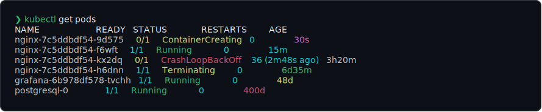
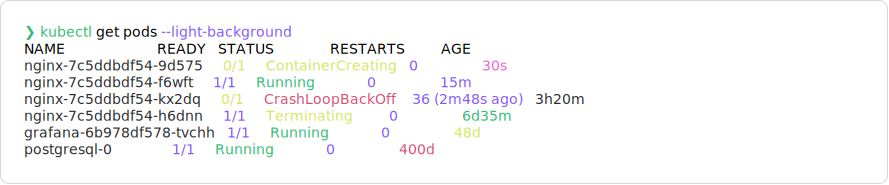
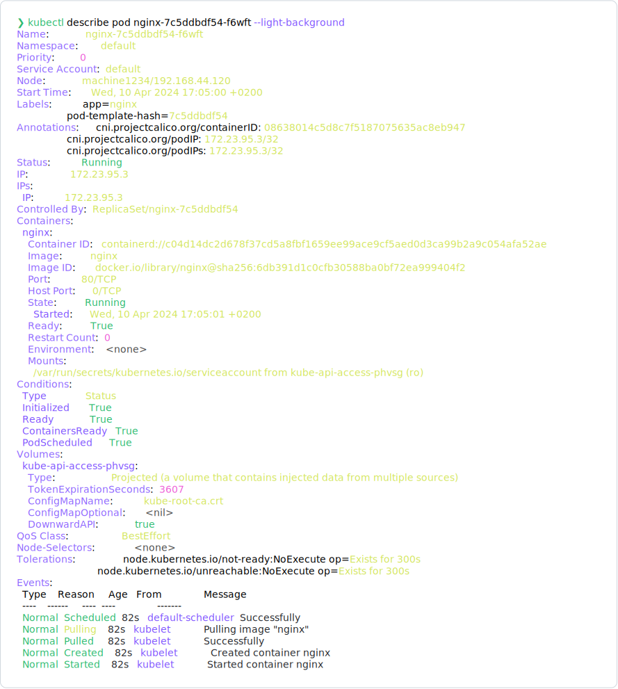

# kubecolor

Kubecolor is a `kubectl` wrapper used to add colors to your kubectl output.

[](https://github.com/kubecolor/kubecolor/actions/workflows/test.yml)
[](https://goreportcard.com/report/github.com/kubecolor/kubecolor)
[](https://codecov.io/gh/kubecolor/kubecolor)




<details>
<summary>You can also change color theme for light-background environment (click to expand)</summary>

> 
>
> 
>
> 

</details>

<details>
<summary><code>[New!]</code> We also have colorblind-adjusted color themes (click to expand)</summary>

> 
>
> 
>
> 
>
> **Note:**
> As of version `v0.3.0`, both `deuteranopia` and `tritanopia` themes are the same as `protanopia`. They may differ in future versions when we better tune them. Set your configuration to match your color-blindness type so you will benefit of the future changes. We gladly accept suggestions on how to improve them.

</details>

## What's this?

kubecolor is a wrapper that colorizes your `kubectl` command output and does nothing else.
It internally calls `kubectl` command and try to colorizes the output so
you can alias kubecolor as a substitute for when you want to run kubectl,
meaning you can write this in your `.bash_profile`:

```sh
alias kubectl="kubecolor"

# Also works for OpenShift CLI
alias oc="env KUBECTL_COMMAND=oc kubecolor"
```

## Features

- Does not tamper with the output. It only adds colors to the `kubectl` output.
- Dynamic TTY detection to send plaintext when called programatically
- Supports autocompletion
- [Custom color themes](https://kubecolor.github.io/customizing/themes/)

## Getting started

Head over to our documentation:

- [Usage / **Getting started**](https://kubecolor.github.io/usage/getting-started/)
- [Usage / **How it works**](https://kubecolor.github.io/usage/how-it-works/)
- [Setup / **Installation**](https://kubecolor.github.io/setup/install/)

## Contributing

Always welcome. There are multiple ways to contribute:

- Starring the repository and spreading the word ❤️

- Creating issues of [bug reports](https://github.com/kubecolor/kubecolor/issues/new?template=bug.yml)
  or [feature requets](https://github.com/kubecolor/kubecolor/issues/new?template=feature.yml)

- Updating documentation, either in this repo or in the [documentation repo (kubecolor.github.io)](https://github.com/kubecolor/kubecolor.github.io)

- Submitting patches
  (look for ["good first issue"](https://github.com/kubecolor/kubecolor/issues?q=is%3Aissue+is%3Aopen+label%3A%22good+first+issue%22)
  if you want something small to get started)

For code contributions, please see: [CONTRIBUTING.md](./CONTRIBUTING.md)

## Versioning

This project tries to follow [SemVer 2.0.0](https://semver.org/)
on the command-line interface (CLI), i.e which flags and environment variables
it accepts.

**We do not** however promise compatibility on the Go source code.
If you import kubecolor's Go module and use it as a library, then things may
unexpectedly break within minor or patch version changes.

> [!WARNING]
> As we have not yet reached v1.0.0, we may have some breaking changes
> in cases where it is deemed necessary.

## LICENSE

MIT

## Author

This project is a heavily modified version of the original kubecolor,
archived at [https://github.com/hidetatz/kubecolor](https://github.com/hidetatz/kubecolor)

[@kubecolor](https://github.com/kubecolor)
